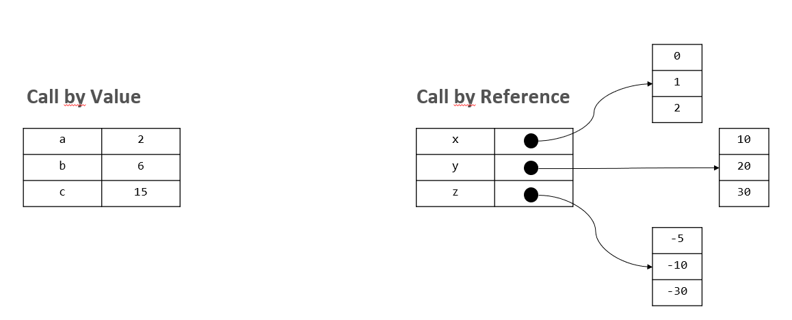
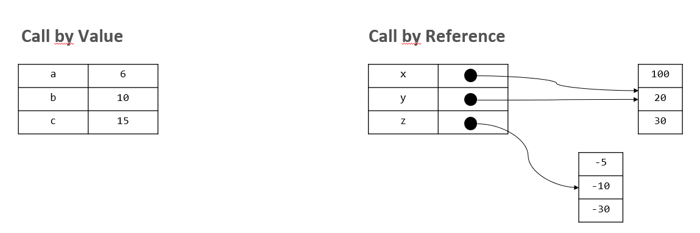

## _V_ **2.2** Weiterführende Konzepte Typescript

### Inhaltsverzeichnis

- [Vorgehensweisen bei der Programmierung](#vorgehensweisen-bei-der-programmierung)
  - [Planung](#planung)
  - [Divide and Conquer](#divide-and-conquer)
  - [Code Duplizierung ist schlecht](#code-duplizierung-ist-schlecht)
  - [Zuständigkeiten Trennen](#zuständigkeiten-trennen)
- [Komplexe Typen](#komplexe-typen)
  - [Array](#array)
  - [Assoziatives Array](#assoziatives-array)
  - [Interface](#interface)
  - [JavaScript Objekt](#javascript-objekt)
  - [Klassen](#klassen)
    - [Zugriffsmodifikatoren](#zugriffsmodifikatoren)
    - [Vererbung](#vererbung)
    - [Polymorphie](#polymorphie)
    - [instanceof](#instanceof)
- [Weitere Typescript Konzepte](#weitere-typescript-konzepte)
  - [Namespaces](#namespaces)
  - [Optionale Parameter](#optionale-parameter)
  - [Rest Parameter](#rest-parameter)
  - [Callstack und Rekursion](#callstack-und-rekursion)
  - [Call by reference / call by value](#call-by-reference--call-by-value)
  - [Spezielle for-Schleifen](#spezielle-for-schleifen)
    - [for..of](#forof)
    - [for..in](#forin)
- [Canvas](#canvas)
  - [Path2D](#path2d)
- [Q&A](#-fragen-und-antworten)

Diese Woche geht es darum, die in der letzten Woche erlernten Grundlagen von JS/TS zu erweitern, um die ganze Bandbreite an wichtigen Sprach-spezifischen Konzepten zu kennen und anzuwenden.

In diesem Kurs sind gewisse Formatvorgaben bzw. [Codingstyle Guidelines](../../codingstyle) einzuhalten. Diese dienen zusammen mit dem TSLinter vorallem der Lesbarkeit und damit dem Verständis sowohl der Studierenden als auch der Prüfer. Sollten Sie diese Guidelines noch nicht gelesen haben, so ist es nun höchste Zeit sich damit vertraut zu machen. Abgaben müssen diesen Regeln entsprechen.

### Vorgehensweisen bei der Programmierung

Zusätzlich zu den stylistischen Guidelines sollen hier auch logische Hilfestellungen gegeben werden, welche es einfacher machen sollen, effizienten, effektiven und guten Code zu schreiben.

#### Planung

Dass Planung wichtig ist, ist eine oftmals belächelte Aussage. Auch ich habe immer wieder darüber geschmunzelt, bis ich damit auf die Nase gefallen bin. Inzwischen weiß ich: Kaum irgendetwas ist in der Entwicklung neben dem eigentlichen Verständnis des Ziels und der Sprache so wichtig wie eine Planung der Konzepte. Es ist so wichtig, dass dafür eine ganze Sprache entwickelt wurde, die [Unified Modeling Language (UML)](https://de.wikipedia.org/wiki/Unified_Modeling_Language). Diese deckt in ihren Möglichkeiten jeden erdenklichen Fall ab und wird von Entwicklern auf der ganzen Welt genutzt, um gemeinsam Vorgänge zu erarbeiten, Strukturen zu klassifizieren und vieles mehr. In diesem Kurs haben wir nicht die Zeit, uns damit zu beschäftigen, auch weil es in einem späteren Semester nochmal vermehrt um das Design von Software gehen wird. Darum an dieser Stelle nur der Hinweis auf die Existenz dieser Sprache sowie ein [UML Cheatsheet](UML_TS_EIA.pdf) von Prof. Jirka Dell'Oro Friedl, welches die für dieses Semester wichtigesten UML Elemente Beispielhaft abbildet und erklärt.

#### Divide and Conquer

Oder manchmal auch "Divide et impera" (lat.: Teile und herrsche) genannt, ist eine Vorgehensweise in der Softwareentwicklung, bei der man sich von den großen Problemen zu den kleinen durcharbeitet. Dieses Prinzip kann auf jede noch so kleine oder große Aufgabe angewandt werden, und hilft gerade am Anfang eine Übersicht über die benötigten Schritte zu erhalten.

Dabei wird das große, als ganzes scheinbar unüberwindbare Problem, so lange in kleinere Teile aufgeteilt, bis diese gelöst sind. Dieser kleinste Schritt kann dabei je nach Wissensstand jede einzelne Zeile Code darstellen oder ganze Subsysteme in einem großen komplexen System.

Durch diese Planung und Vorbereitung fallen einem oftmals im Voraus schon potenzielle Probleme, Wissenslücken und Optimierungsmöglichkeiten ein, welche man dann im Voraus umgehen, schließen und nutzen kann, um so ein besseres Endergebnis zu erhalten. Auch kann so Code Duplizierung im Voraus entgegen gewirkt werden, da man einen besseren Überblick hat, welche Teile mehrfach genutzt werden.

> Hinweis: Die Implementation und der Test einzelner Subsysteme sollte stets isoliert vom Gesamtsystem sein. So können einzelne Teilaspekte auf ihre Funktionalität überprüft werden, ohne dass alles Implementiert sein muss. Testen Sie darum wenn es sein muss jede Zeile die Sie schreiben einzeln, damit Sie sich sicher sein können, dass diese das tut was sie soll.

#### Code Duplizierung ist schlecht

Um Code sowohl übersichtlich als auch anpassbar und wartbar zu halten, ist es ratsam, sich wiederholende Anweisungen und Abschnitte in Funktionen zu kapseln, um diese Abschnitte wiederverwenden zu können. Dank Übergabeparametern können Funktionen im Regelfall so modular entwickelt werden, dass sie für alle ähnlichen Anwendungsfälle auch funktionieren.  
Ähnlich, wenn auch offensichtlicher, verhält es sich mit Schleifen. Niemand würde 10 mal die gleiche Zeile schreiben, wenn man stattdessen eine Schleife nutzen kann. Allerdings ist es natürlich nicht immer so offensichtlich, darum sollte man sowohl bei der Planung als auch bei der Umsetzung immer folgende Faustregel im Kopf haben.

> Faustregel: Statt einen Codeabschnitt zu kopieren, um ihn an anderer Stelle einzufügen und wieder zu verweden, sollte dieser besser in eine Funktion ausgelagert werden, welche - ggf. mit passenden Übergabeparametern versehen - an beiden Stellen aufgerufen werden kann.

#### Zuständigkeiten trennen

Selbst ohne duplizierten oder sich wiederholenden Code ist es oft ratsam, ein großes Programm in mehrere Funktionen zu unterteilen, welche verschiedene Zuständigkeiten haben. So so ist, statt einer 200 Zeilen langen `main` Funktion, es deutlich besser zu lesen, verstehen und warten, wenn man diese auf 10 kleinere, übersichtlichere Funktionen mit klaren Aufgaben verteilt. Wenn man z.B. eine Webseite aus Daten generieren möchte (wie wir das in den kommenden Wochen tun werden), könnte man das aufteilen in eine Funktion welche die Daten einließt, eine welche in der statischen Seite die Interaktivität (EventListener, s. [DOM Manipulation und Eventhandling](../L2.3))) verleiht, eine Funktion welche die Daten durchgeht und eine welche die HTML Seitenelemente anlegt und befüllt.

Aufgrund dieses Grundsatzes sollten auch Daten (json, Datenbanken), Struktur (HTML), Darstellung (CSS) und Funktionalität (JS/TS) getrennt werden. So sollten CSS oder JS nicht in der HTML Datei eingbettet werden (auch wenn das möglich ist) oder Dateien, welche ausschließlich Daten beinhalten, von denen die Funktionalität beinhalten getrennt gehalten werden.

### Komplexe Typen

Neben den einfachen Typen (`number, string, boolean`) hat JS/TS auch komplexe Typen zu bieten, welche einige Besonderheiten aufweisen. Die hier dargestellte Liste zeigt bei weitem nicht alle existierenden / eingebauten Typen auf, sondern lediglich die relevantesten.

#### Array

Ein (homogenes) Array erlaubt es, mehrere Elemente des gleichen Typs in einer Art Liste zu speichern. Es wird deklariert indem hinter den zu verwendenden Typ eckige Klammern geschrieben werden. Auch werden die Werte in eckigen Klammern definiert.

```ts
let numberArray: number[] = [0, 10, 42];
let emptyArray: string[] = [];
```

Dabei wird jedem Eintrag in dieser Liste automatisch ein fortlaufender index zugeordnet, beginnend bei 0. Arrays haben in JS/TS eine dynamische Länge, sind also immer genau so lang wie sie sein müssen um alle Elemente speichern zu können.

Über eckige Klammern hinter dem Bezeichner kann auch auf bestimmte Stellen in diesem Array zugegriffen werden, wie man auf normale Variablen zugreifen würde.

```ts
console.log(numberArray[0]);  // 0
console.log(numberArray[1]);  // 10
console.log(numberArray[2]);  // 42
console.log(numberArray[1] + numberArray[2]); // 52
```

**Wichtigste Methoden und Attribute**

-`length` gibt die Gesamtanzahl der enthaltenen Elemente zurück.

```ts
console.log(numberArray.length); // 3
```

`.push()` fügt ein Element ans Ende des Arrays an.

`.pop()` entfernt das letzte Element aus einem Array und gibt dieses zurück.

`.slice()` selektiert einen Teil des Arrays und gibt nur diesen als neues Array zurück.

`.splice()` entfernt (und ersetzt) Elemente aus dem Array

> Die Offenheit von JS erlaubt es, jede Art von Variable in ein Array zu speichern (heterogen), selbst andere Arrays. Und während letzteres praktisch ist, um _mehrdimensionale Arrays_ anzulegen, so ist ersteres in Typescript nicht erlaubt.

```ts
let a: number[] = [42, true, "Hallo"]   //JS: okay, TS: error

// ein Array welches zwei Dimensionen hat.
let mult: number[][] = [[1, 2, 3], [10, 20, 30], [100, 200, 300]]
console.log(mult[1][2]); // 30
```

#### Assoziatives Array

In einem Assoziativen Array wird statt dem automatisch generierten Index eines normalen Arrays der Index / Schlüssel durch den Entwickler selbst bestimmt (im häufigsten Fall ein `string`) und dieser dann mit dem Wert verknüpft. Ein solches assoziatives Array wird in der Regel mit Hilfe geschweifter Klammern erzeugt, wobei innerhalb der Klammern bereits Schlüssel-Werte-Paare angegeben werden können. Die Assoziation wird durch den Doppelpunkt : dargestellt.

```js
let assoArray = {"zahl": 42, "wahr": true, "text": "Hallo"};
console.log(assoArray["text"]) // "Hallo"
```

Nicht nur die Datentypen sind heterogen, sondern auch die Schlüssel können beliebig gewählt werden. Das ermöglicht große Flexibilität, aber auch Fehler, die schwer zu finden sind. Um assoziative Arrays stringenter zu strukturieren, stellt TypeScript interfaces zur Verfügung. Damit lassen sich Schlüssel vordefinieren und die Datentypen für Werte und Schlüssel einschränken.

Im folgenden Beispiel sind die Schlüssel frei wählbar, sind aber auf den Typ string beschränkt, und das Array ist auf Wahrheitswerte homogenisiert.

```ts
interface MapStringToBoolean {
  [key: string]: boolean;
}

let a: MapStringToBoolean = {"wert1": true, "wert2": false};
console.log(a["wert1"]); // true
```

#### Interface

Interfaces erlauben aber noch mehr als nur Arrays zu definieren. Sie können jede Form von eigenem Datentyp definieren, und so die Entwicklungszeit und das Programm als ganzes deutlich verbessern.

Dabei werden im Interface feste Namen für verschiedene Attribute festgelegt, welche dann auch so vom Typescript compiler eingefordert werden. Attribute sind Variablen, die einem bestimmten Objekt zugeordnet sind. Sie können über die Punktnotation abgefragt werden.

> Da wir mit interfaces sozusagen unsere eigenen Komplexen Typen definieren, sollten diese groß geschrieben werden.

```ts
interface Dog {
  name: string;
  owner: string;
  age: number;
}

let d1: Dog = {name: "Bello"} // Error: Es fehlen owner und age
let d2: Dog = {name: "Sir Woofalot", owner: "Martin", age: 5};
console.log(d2.age); // 5
```

> Auch in interfaces können Werte als optional markiert werden, die Syntax ist dabei die gleiche wie in Funktionen.

```ts
interface Dog {
  ...
  owner?: string
  ...
}
```

#### JavaScript Objekt

Ein Objekt ist ein heterogenes assoziatives Array, dem Funktionen anheften. Diese Funktionen können die Elemente des Arrays verändern, ohne dass ihnen Informationen zu dem Objekt mitgegeben werden müssen, denn sie sind ja ein Teil davon und haben Zugriff darauf. Um diese Funktionen von den üblichen zu unterscheiden werden sie Methoden genannt. Ein Objekt verfügt also über Methoden, mit der es sich, oder auch seine Umwelt, verändern kann.

Tatsächlich ist alles in JS im Kern ein Objekt. Selbst die primitiven Datentypen gaukeln nur ihre Primitivität vor, wodurch sie sich einsetzen lassen wie in ‘klassischen’ Programmiersprachen (und so zum Beispiel auch eigene Methoden und Attribute haben können wie `string.length` oder `number.toFixed()`).

#### Klassen

Klassen sind ein in JS erst kürzlich integriertes Konstrukt, welches dem Ansatz der etablierteren objektorientierten Programmierung folgt. Darum sind diese nicht vollständig in JS integriert worden. Aber TS gibt uns hier die Möglichkeiten, dieses Konstrukt voll zu nutzen.

Klassen sind fest definierte JS Objekte, welche wie interfaces auch ihre _Attribute_  definieren, zusätzlich aber auch eigene _Methoden_ haben können. Diese Methoden erlauben es, wie in JS Objekt bereits erläutert, dem Objekt selbst beizubringen, wie es sich zu verhalten hat. Genau wie die Attribute brauchen auch sie keine Schlüsselworte zur Definition sondern werden durch Klammern `()` von den Attributen unterschieden. 

```ts
class Vector {
  x: number;
  y: number;

  scale(_factor: number): void {
    this.x *= _factor;
    this.y *= _factor;
  }

  add(_addend: Vector): void {
    this.x += _addend.x;
    this.y += _addend.y;
  }
}
```

Das Praktische an einer solchen Kapselung ist, dass das Programm, das einen solchen Vektor nutzt, nun nicht mehr wissen muss, wie man einen Vektor skaliert oder einen zweiten hinzuaddiert. Es genügt zu wissen, dass man es tun kann und welche Parameter der Vektor hierzu braucht. Den Rest macht der Vektor selbst. Damit wird der Vektor zu einer Black-Box, deren interne Arbeitsweise nicht bekannt sein muss, um sie zu verwenden. Der Vektor ist “gekapselt”.

```ts
class Dog {
  name: string;
  age: number;

  createDog(_name: string): void{
    this.name = _name;
    this.age = 0;
  }
  increaseAge(_age?: number): void{
    this.age += _age;
  }
  bark(): void {
    console.log(`My name is ${this.name} and I say: Woof!`);
  }
}
```

Um eine Klasse nutzen zu können, muss eine neue _Instanz_ dieser Klasse angelegt werden. Dies wird durch das `new` Schlüsselwort erzielt. Klassen brauchen eine Instanz um zu funktionieren, da die Attribute und Methoden dieser Instanz zugeordnet werden müssen, um so den Zusammenhang herzustellen.

```ts
let d: Dog = new Dog();
d.createDog("Bello");
d.bark(); // "My name is Bello and I say: Woof!"
console.log(d.age); // 0
```

Das `this` Schlüsselwort bezieht sich dabei auf die aktuelle Instanz. So kann von innerhalb der Klasse auf ihre eigenen Attribute und Methoden zugegriffen werden.

> ⚠️ `this` ist stark Kontextabhängig und kann sich unter Umständen unerwartet ändern (z.B. wenn eine Methode von außerhalb aufgerufen wird). Korrektes `this`-Handling ist eines der schwierigsten Konzepte in JS, darum scheuen Sie sich nicht vor Fragen wenn dabei etwas schief gehen sollte!

Im obigen Beispiel wird ein neuer Hund angelegt und dieser dann in der nächsten Zeile über die `createDog()` Funktion mit Namen und Alter initialisiert. Ohne diese Funktion wäre es also ein undefinierter Hund.

```ts
let d: Dog = new Dog();
console.log(d.name); // undefined
```

Diese Initialisierung von Klasseninstanzen ist so ein häufiges Problem, dass die Entwickler dieser Welt sich auf eine einheitliche Methode geeinigt haben: einen **Konstruktor**.

Dieser Konstruktor ist eine fest definierte Methode mit dem Namen `constructor()` und jede Klasse hat implizit einen Konstruktor, auch wenn diese Methode nicht explizit implementiert wird. Um genau zu sein ist das die Methode, die hinter `new` aufgerufen wird (`Dog()`) und die neue Instanz erzeugt. Da dies die neue Instanz zurückgeben muss, darf **diese spezielle Methode nichts zurückgeben**. Hier die geänderte Dog Klasse.

```ts
class Dog {
  name: string;
  age: number;

  constructor(_name: string, _age: number = 0): void{
    this.name = _name;
    this.age = _age;
  }
  increaseAge(_age?: number): void{
    this.age += _age;
  }
  bark(): void {
    console.log(`My name is ${this.name} and I say: Woof!`);
  }
}

let d: Dog = new Dog("Bello", 3);
```

##### Zugriffsmodifikatoren

In den meisten Objektorientierten Sprachen gibt es Zugriffsmodifikatoren welche steuern sollen, wer auf gewisse Attribute und Variablen Zugriff hat. So auch in Typescript.

`private` nur die Klasse selbst hat Zugriff.

`protected` nur die Klasse selbst und alle Subklassen (s. [Vererbung](#vererbung)) haben Zugriff.

`public` jeder hat Zugriff. Standard.

Wenn wir unseren Hund nun so modifizieren, dass sein Alter privat ist, damit man dieses nicht einfach ändern kann, dann ergäbe sich folgendes Bild:

```ts
class Dog {
  public name: string;
  private age: number;

  constructor(_name: string, _age: number = 0): void {  //⚠️ Den Konstruktor private zu machen bedeutet, es unmöglich zu machen, von dieser Klasse Instanzen anzulegen! 
    this.name = _name;
    this.age = _age;
  }
  public increaseAge(_age?: number): void{
    this.age += _age;
  }
  public bark(): void {
    console.log(`My name is ${this.name} and I say: Woof!`);
  }
}

let d: Dog = new Dog("Bello", 3);
d.name = "Schnuffel"; // kein Error
console.log(d.age);   // TSError: "age" ist nicht öffentlich zugreifbar
d.age = 10;           // TSError: "age" ist nicht öffentlich zugreifbar
```

> ⚠️ Diese Zugriffsmodifikatoren sind nur ein von TS eingebauter Kniff und wirken sich nicht auf JS aus. Erst mit der neusten JS Version wurden private Modifikatoren eingeführt, welche durch ein `#` als erstes Zeichen des Attributnames definiert werden.

```js
class Dog {
  name: string;
  #age: number;
}
```

##### Vererbung

Eine Klasse kann ihre Eigenschaften und Methoden an andere Klassen weitergeben. Oder anders herum formuliert: Eine Klasse kann eine bereits bestehende Klasse um weitere Eigenschaften und Methoden erweitern. Die Klasse, von der geerbt wird, nennt sich dabei **Superklasse**. Die Klasse die erbt, nennt sich **Subklasse**.

Ein solches Vererbungsverhältnis wird oft genutzt, wenn verschiedene Klassen viele Gemeinsamkeiten haben, welche dann als gemeinsame Oberklasse realsiert werden. Will man Beispielsweise neben der `Dog` Klasse noch eine `Cat` Klasse entwickeln, dann hätten diese viele Gemeinsamkeiten. Diese könnte man dann in einer gemeinsamen Klasse zusammenfassen und nur die Tierspezifischen Änderungen in den jeweiligen Klassen implementieren.

```ts 
class DomesticAnimal {
  name: string;
  age: number;
  color: string;
  owner?: string;
  constructor(_name: string, _color: string, _age: number = 0, _owner: string = ""){
    console.log("Animal Constructor")
    this.name = _name;
    this.age = _age;
    this.color = _color;
    this.owner = _owner;
  }
  makeSound() {
    console.log("<undefined Animal Sound>")
  }
}

class Dog extends DomesticAnimal {
  goodBoyOrGirl: boolean;
  constructor(_name: string, _color: string, _age: number = 0, _goodBoyOrGirl: boolean = true, _owner: string = "") {
    console.log("Dog Constructor")
    super(_name, _color, _age, _owner);
    this.goodBoyOrGirl = _goodBoyOrGirl;
  }
  makeSound(){
    console.log("woof!");
  }
}

class Cat extends DomesticAnimal {
  makeSound() {
    console.log("maunz!");
  }
}

let a: DomesticAnimal = new DomesticAnimal("Anim", "schwarz");
let c: Cat = new Cat("Rey", "getiegert", 2);
let d: Dog = new Dog("Bello", "weiß", 5, true);

a.makeSound(); // "<undefined Animal Sound>"
c.makeSound(); // "maunz!"
d.makeSound(); // "woof!"
```

Dabei kann eine Klasse nicht nur erweitert, sonder ähnlich wie mit lokalen Variablen auch überschrieben werden. So überschreiben sowohl die Katze als auch der Hund die `makeSound` Funktion so, dass diese jeweils etwas anderes tun wenn sie aufgerufen werden.

Der Konstruktor stellt dabei wieder mal einen Spezielfall dar, da eine Subklasse nur eine "verfeinerung" der Superklasse darstellt, muss die Superklasse auch weiterhin angelegt werden. Um auf Methoden der Superklasse zuzugreifen, wird das Schlüsselwort `super` verwendet, so kann der Konstruktor der Superklasse über `super()` aufgerufen werden.
Während `Cat` keinen eigenen Konstruktor definiert und darum automatisch den Animal Konstruktor mitverwendet, überschreibt Dog den Konstruktor da dieser ein neues Attribut befüllen möchte.

`super.makeSound()` würde in der Katze oder Hunde Klasse `"<undefined Animal Sounds>"` auf der Konsole ausgeben. So ist es also möglich die spezifische Funktionalität der Superklasse beizubehalten / explizit zu verwenden, selbst wenn eine eigene Implementation diese Überschreibt.

> Weitere Informationen zu Klassen in Typescript finden Sie in der [offiziellen Dokumentation](https://www.typescriptlang.org/docs/handbook/classes.html) (Englisch) oder auch in den [Kursmaterialien zu EIA2](https://jirkadelloro.github.io/EIA2-Inverted/L09_Classes/).

##### Polymorphie

Polymorphie / Polymorphismus (griechisch: Vielgstaltigkeit) ist ein Konzept in der objektorientierten Programmierung das es erlaubt, dass Subklassen auch als Variablen der Superklasse gespeichert werden können.

Dank diesem Prinzip können wir alle drei Tiere in ein `DomesticAnimal` Array packen, auch wenn `c` und `d` Spezialisierungen dieser Klasse sind und nicht mehr die Superklasse selbst.

Dies ist sehr praktisch, wenn man statt mehrerer Variablen / Arrays für verschiedene Subklassen diese alle in einer gemeinsamen Struktur speichern möchte und sie alle das gleiche tun lassen(mit den jeweils eigenen Implementationen) .

```ts
let allAnimals: DomesticAnimal[] = [a, c, d];

for(let animal of allAnimals){
  animal.makeSound();
}
```

##### instanceof

Wenn es nun aber doch wieder wichtig ist, von welcher Klasse eine Variable ist, so kann der (Vergleichs-)Operator `instanceof` genutzt werden.

```ts
console.log(c instanceof Dog); // false
console.log(d instanceof Dog); // true
```

`instanceof` gibt auch dann `true` zurück, wenn die überprüfte Klasse eine Instanz einer Subklasse ist.

```ts
console.log(c instanceof DomesticAnimal); // true
console.log(d instanceof DomesticAnimal); // true
```

### Weitere Typescript Konzepte
#### Namespaces

Alle Dateien in einem TS Projekt werden als "global bekannt" angesehen. Da das gesamte Repository als ein großes Projekt angesehen wird, ist jede `.ts` Datei Teil des globalen Namensraums. Das bedeutet wiederum, dass ein Variablenname immer nur einmal vorkommen kann.

`aufgabe1.ts`
```ts
let x: number = 10;
```

`aufgabe2.ts`
```ts
let x: number = 42;   //ERROR: Doppelte Variablendeklaration 
```

Um dieses Problem zu umgehen, können Namensbereiche / Namespaces genutzt werden. Sie schaffen, wie der Name impliziert, einen Bereich, in dem Variablennamen von andereren Variablennamen abgeschirmt werden, um Namenskonflikten vorzubeugen oder logische Unterteilungen zu schaffen.

`aufgabe1.ts`
```ts
namespace Aufgabe1 {  
  let x: number = 10;
}
```

`aufgabe2.ts`
```ts
namespace Aufgabe2 {
  let x: number = 42;   //kein Error
}
```

Will man auf die Variablen / Interfaces / Klassen / etc. anderer Dateien zugreifen, so kann man dies explizit tun, indem man die zu verwendende Variable mit `export` markiert. So ist diese automatisch in anderen Dateien mit dem gleichen Namespace verfügbar und kann außerdem in anderen Namensräumen importiert werden.

> ⚠️ Ggf. muss man auch den namespace mit einem export markieren. In anderen Fällen sorgt eben dies für eine Fehlermeldung. Dies hängt von der lokalen Typescriptversion ab und kann bei jedem Computer unterschiedlich sein.

> Bei dieser Nutzung mehrerer Dateien muss auf die import Reihenfolge in der HTML Datei geachtet werden, damit die Daten der ersten Datei vorliegen um in der zweiten Datei verwendet zu werden.

`aufgabe1.ts`
```ts
(export) namespace Aufgabe1 {  
  export let x: number = 10;
}
```
`aufgabe2.ts`
```ts
import { Aufgabe1 } from "./aufgabe1"
namespace Aufgabe2 {
  let x: number = 42;
  console.log(Aufgabe1.x);
}
```

Auf diese so exportierten Variablen kann über die Objekt-Punkt-Notation zugegriffen werden.

#### Optionale Parameter

Während Javascript willentlich ignorant über die Menge an übergebenen und erwarteten Paramtern hinwegsieht, ist Typescript da deutlich restriktiver.

```js
function square(x) {
  return x * x;
}
console.log( square( 4, false, "Käsekuchen") );
```

Dieser Code funktioniert ohne Probleme in JS, da es die zusätzlich übergebenen Parameter einfach ignoriert. Auf der anderen Seite wird JS Parameter, welche nicht befüllt wurden, einfach mit einem `undefined` versehen.

```js
function print(x, y){
  console.log(x, y);
}
print("hi") //-> Gibt folgendes auf der Konsole aus: "hi" undefined
```

Dies verhindert Typescript standardmäßig, und haut dem Entwickler auf die Finger wenn eine falsche Anzahl an Parametern übergeben werden. Allerdings hat diese Vorgehensweise auch Vorteile, darum gibt es in Typescript die Möglichkeit einen Parameter als "optional" zu markieren: `?:`. Dabei müssen optionale Parameter sich stets am Ende der Parameterliste befinden.

```ts
function minus(a: number, b?: number): number {
  if (b === undefined) return -a;
  else return a - b;
}

console.log(minus(10));     // -> -10
console.log(minus(10, 5));  // -> 5
```

Diese Funktion gibt je nach Menge der Parameter entweder die übergebene Zahl negiert zurück, oder subtrahiert die zweite von der ersten. 

Alternativ kann eine Variable auch einen Standardwert zugewiesen bekommen, der nicht `undefined` ist, indem einfach im Funktionskopf der Wert zugewiesen wird. In der folgenden Funktion welche das exponential berechnet, wird standardmäßig die Quadratur angenommen ("hoch 2"), sofern kein zweiter Parameter übergeben wird. 

```ts
function power(base: number, exponent: number = 2){
  let result = 1;
  for (let count = 0; count < exponent; count++) {
    result *= base;
  }
  return result;
}

console.log(power(10))    // -> 100
console.log(power(2, 6))  // -> 64
```

#### Rest Parameter

Für eine Funktion kann es sinnvoll sein, eine unspezifische Menge an Parametern entgegen zu nehmen. Die Funktion `console.log()` zum Beispiel kann eine beliebige Anzahl von Parametern auf der Konsole ausgeben, während die `Math.max()` Funktion aus beliebig vielen Parametern das Maximum zurück gibt.

Um eine solche Funktion zu definieren, schreibt man drei Punkte vor den _letzten Parameter_ der Funktion. Wenn die Funktion aufgerufen wird, werden alle Variablen, welche nicht in eine der vorherigen Parameter gehören, in ein Array gespeichert und können so genutzt werden.

```ts
function printAll(...outputs): void {
  for(let i: number = 0; i < outputs.length; i++){
    console.log(output[i]);
  }
}
printAll(1, 2, 3, 4, 5);
```

#### Callstack und Rekursion

Wenn ein Programm ausgeführt wird und dabei von Funktion zu Funktion gesprungen wird, muss gespeichert werden, an welche Stelle der Code zurückkehren muss, wenn eine Funktion beendet wird. Der Ort an welchem diese Information gespeichert wird nennt sich der "Stack". 

Diesen Stack zu speichern und verwalten kostet Speicherplatz. Und wenn der für den Stack zugewiesene Speicher überschritten wird, wird das Programm mit einem Fehler beendet (meist "too much/deep recursion" oder "Out of stack space"). Der folgende Code demonstriert das, indem er dem Computer eine Frage stellt, für die er unendlich lange zur Berechnung braucht (da sie unmöglich zu lösen ist). Oder er würde unendlich lange brauchen, wenn der Callstack da nicht dazwischen grätschen würde.

```ts
function chicken(): string {
  return egg();
}
function egg(): string {
  return chicken();
}

console.log(chicken(), "war zuerst da.");
```

Ein solches Auslösen von Funktionen, bei denen sich die Funktionen selbst aufrufen (auch über Umwege) nennt man auch **Rekursion** (lat.: recurre, "zurücklaufen"). Sie erlauben es, teilweise komplizierte Probleme einfach und effizient zu lösen. Allerdings steht dem gegenüber eine limitierte Stack Größe, welche das Programm abstürzen lassen kann, sofern es überschritten wird. 

> Jede (direkte) Rekursion lässt sich auch als Schleife umschreiben (und umgekehrt), was in manchen Fällen (tiefe zu erwartende Rekursion) ratsam ist.

```ts
function factorial(n: number): number {
  let result: number = 1;
  while (n > 1){
    result *= n;
    n -= 1;
  }
  return result;
}
```
```ts
function factorial(n: number): number {
  if(n <= 1){
    return 1;
  }
  return n * factorial(n - 1);
}
```

Beide Funktionen berechnen die Fakultät (`1*2*3*...*n`) einer Zahl. Die erste Iterativ, die zweite Rekursiv.

#### Call by reference / call by value

Bei den einfachen Typen (number, string, boolean, (void)) wird in JS/TS der _Wert_ direkt in der Variable selbst gespeichert und bei Kopien wird der Wert selbst kopiert, zum Beispiel wenn die Variable in eine andere Variable gespeichert wird oder an eine Funktion übergeben wird.

Dagegen wird in der Variable für komplexe Typen (Arrays, JS Objekte, etc), nur ein _Verweis_ auf die eigentlichen Werte gespeichert. Dies dient unter anderem der Variabilität und erlaubt so, dass bestehende Objekte erweitert werden können, ohne dass manuell neuer Speicherplatz angelegt werden muss. In diesem Fall wird nur die Referenz übergeben/kopiert, was bedeutet, dass mit den eigentlichen Werten gearbeitet wird, statt mit einer Kopie.

Es folgt ein Beispiel über die Auswirkungen die dieser Unterschied haben kann. Die Situation bevor der Code ausgeführt wird:

```ts
let a: number = 2;
let b: number = 6;
let c: number = 15

let x: number[] = [0, 1, 2]
let y: number[] = [10, 20, 30]
let z: number[] = [-5, 10 -30]
```



Nun wird der folgende Code ausgeführt. Versuchen Sie nachzuvollziehen, wie es zu der Endsituation kommt.

```ts
//Call by Value
a = b;            // a = 6, b = 6
b = 10;           // a = 6, b = 10
console.log(a);   // 6

//Call by Reference
x = y;              // (x = y) --> [10, 20, 30]
y[0] = 100;         // (x = y) --> [100, 20, 30]
console.log(x[0]);  // 100
```



Gleiches gilt bei Funktionsaufrufen mit Parametern.

```ts
//Call by Value
let a: number = 100;
let b: number = addOne(a);
console.log(a, b);          // 100, 101

function addOne(n: number): number {
  return n++;
}

//Call by Reference
let x: number[] = [1, 2, 3];
let y: number[] = appendOne(x);
console.log(x, y);          // [1, 2, 3, 0], [1, 2, 3, 0]

function appendOne(arr: number[]): number[] {
  arr.push(0);        //hier wird direkt auf dem übergebenen Array gearbeitet
  return arr;
}
```

Dies ist zu beachten, wenn mit komplexen Typen gearbeitet wird, da dies viele unerwartete Nebenwirkungen haben kann.

#### Spezielle for-Schleifen

Neben der bekannten `for (Vorbedingung/Startwert; Laufbedingung; Änderung der Zählvariable / Schrittweite) {}` Variante der for-Schleife gibt es zwei weitere und sehr praktische Varianten, die den häufigen Nutzungsfall abdecken, ein komplexes Objekt mit Schlüssel-Werte Paaren (Arrays, JS Objekte) zu durchlaufen.

##### for..of

Die for-of Schleife deckt dabei alle iterierbaren Objekte (z.B. Arrays, Listen) ab und gibt die _Werte_ der Liste nacheinander aus.

```ts
let arr: number[] = [10, 20, 42];

for(let num of arr){        //keine Typannotation für num
  console.log(num);         //10, 20, 42
}
```

Der Typ der Variable wird implizit aus dem zu iterierenden Objekt übernommen.

##### for..in

for-in Schleifen iterieren zusätzlich zu den von for-of Schleifen abgedeckten Elementen auch über JS Objekte (und damit letztendlich über alles was ein komplexer Typ ist). Der Unterschied zur for-of Schleife ist aber auch, dass for-in den _Schlüssel_ ausgibt, während for-of den _Wert_ ausgibt.

```ts
let arr: number[] = [10, 20, 42];

for(let key in arr){        //keine Typannotation für key, immer string.
  console.log(key);         // "0", "1", "2"
  console.log(arr[key]);    // 10, 20, 42 
}

let obj: SomeInterface = {
  name: "Lukas",
  age: 25
}

for (let key in obj) {
  console.log(key);         // "name", "age"
  console.log(obj[key]);    // "Lukas", 25 
}
```

Der Typ des Schlüsselwertes den for-in ausgibt, ist immer ein String.

### Canvas

Der Canvas (engl.: Leinwand) ist ein HTML Element, welches es erlaubt auf ihm zu zeichnen und Bilder anzeigen zu lassen. Dieses kann man einfach in sein HTML Dokument einfügen und dann im JS/TS nutzen. Dabei ist es ratsam, dem canvas eine feste ID zu geben, um ihn einfacher aus dem Dokument heraus zu finden. Dem Canvas sollte außerdem eine Höhe und Breite gegben werden.

```html
<canvas id="myFirstCanvas" width="500px" height="400px"></canvas>
```

So kann dann aus dem Dokument der Canvas wie folgt herausgefunden werden (mehr zu diesen Befehlen in der kommenden Woche):

```ts
let canvas: HTMLCanvasElement = <HTMLCanvasElement> document.getElementById("myFirstCanvas");
```

Der Canvas stellt einen [CanvasRenderingContext2D](https://developer.mozilla.org/en-US/docs/Web/API/CanvasRenderingContext2D) zur Verfügung, auf welchem die Zeichenoperationen ausgeführt werden können.

```ts
let context: CanvasRenderingContext2D = canvas.getContext("2d");
```

```ts
context.lineWidth = 10;

context.strokeRect(75, 140, 150, 110);

context.fillRect(130, 190, 40, 60);

context.beginPath();
context.moveTo(50, 140);
context.lineTo(150, 60);
context.lineTo(250, 140);
context.closePath();
context.stroke();
```

Da es zu umfangreich wäre, sämtliche Canvas Funktionalitäten hier zu erläutern, sollten Sie sich selbst damit auseinandersetzen. Hier ist ein [Canvas CheatSheet](HTML5_Canvas_Cheat_Sheet.pdf) das Ihnen dabei helfen soll.

Nutzen Sie auch [https://www.html5canvastutorials.com/](https://www.html5canvastutorials.com/) für weitere Informationen und einfache Schritt für Schritt Anleitungen.

#### Path2D

Wie man am obigen Codebeispiel sehen kann, müssen beim context zunächst Pfade gestarted und beendet werden, welche dann jeweils gezeichnet (`stroke`) und gefüllt (`fill`) werden können. Statt diese aber auf dem Canvas zu halten und ggf. zu überschreiben (mit `beginPath` wird der enthaltene Pfad gelöscht und ein neuer angelegt), können sie stattdessen in Path2D Objekten angelegt, verwaltet und wiederverwendet werden.

Auf einer Instanz der Path2D Klasse können alle Pfad-relevanten Funktionen ausgeführt werden, die sonst direkt auf dem context ausgeführt worden wären.

 Zum Zeichnen eines solchen Pfadobjektes wird es schließlich als Parameter der Zeichenmethode einfach mitgegeben.

```ts
let path: Path2D = new Path2D();
path.arc(60, 60, 50, 0, 2 * Math.PI);
context.stroke(path);
```


## **?!** Fragen und Antworten

(die Publikation der Zusammenfassung erfolgt nach dem Q&A-Termin)

Zusammenfassung von: [&lt;username&gt;](https://github.com/)
