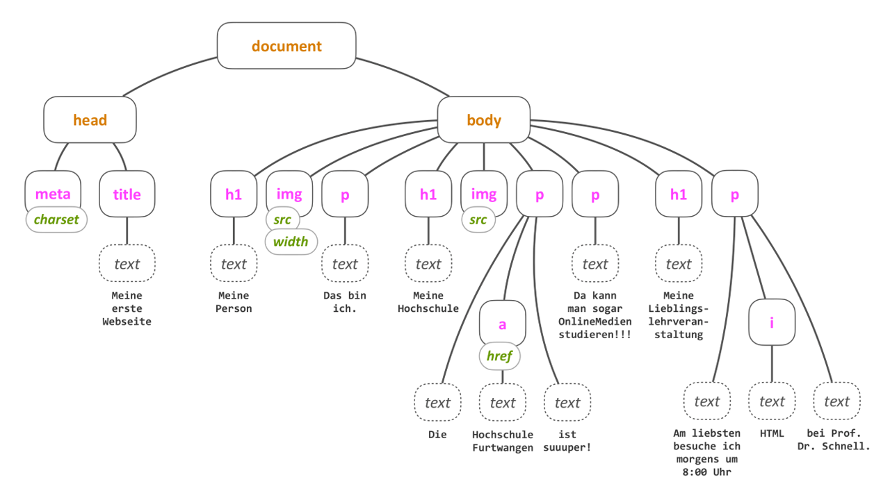
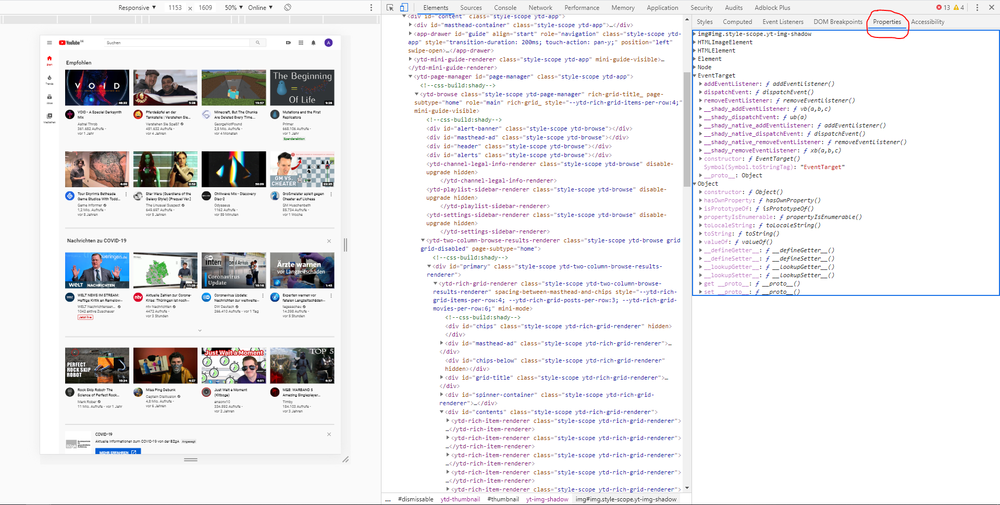
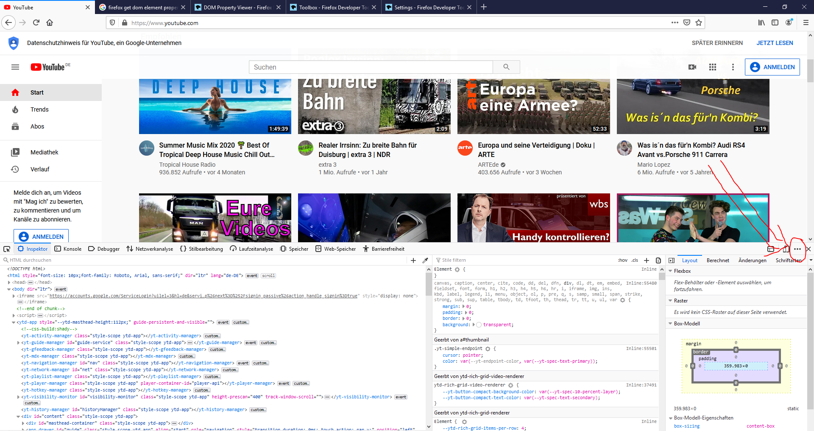
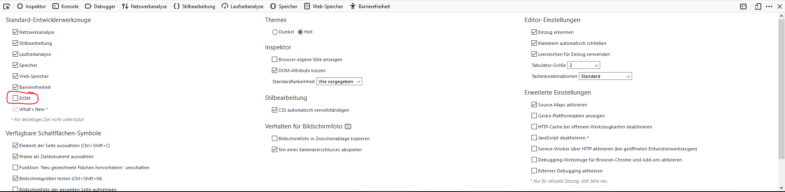
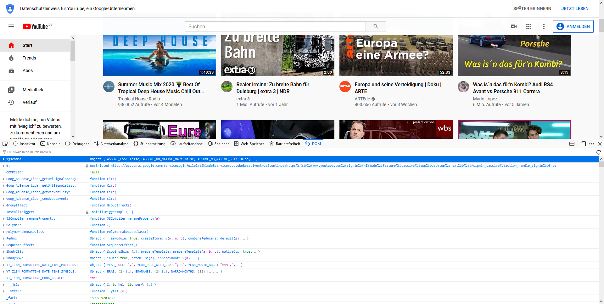

## _V_ **2.3** DOM Manipulation und Event Handling

### Inhaltsverzeichnis

- [DOM](#dom)
  - [DOM Manipulation](#dom-manipulation)
  - [Baumstruktur](#baumstruktur)
  - [DOM Elemente in TS ansprechen](#dom-elemente-in-ts-ansprechen)
    - [Elemente erschaffen](#elemente-erschaffen)
    - [Typassertion](#typassertion)
  - [DOM Untersuchen](#dom-untersuchen)
  - [Daten in DOM Elementen speichern](#daten-in-dom-elementen-speichern)
- [Ereignisse](#ereignisse)
  - [Event Objekt](#event-objekt)
  - [Target](#target)
  - [Type](#type)
- [Event Handler](#event-handler)
  - [Handler-Implementation](#handler-implementation)
  - [Listener-Installation](#listener-installation)
- [Event Phasen](#event-phasen)
  - [Phase 1: Capture](#phase-1-capture)
  - [Phase 2: Target](#phase-2-target)
  - [Phase 3: Bubble](#phase-3-bubble)
  - [Listener-Options](#listener-options)
  - [CurrentTarget](#currenttarget)
  - [Path](#path)
- [Q&A](#-fragen-und-antworten)

### DOM
Lädt der Browser eine Datei und versucht diese als HTML-Datei zu interpretieren, baut er anhand der Daten im Speicher ein **Document-Object-Modell** (DOM) auf. Was schließlich im Browserfenster angezeigt wird, ist also nicht ein direktes Abbild der Datei, sondern ein Abbild dieses internen Speichermodells. 

Dabei wird aus den Elementen in der HTML Datei eine große Baumstruktur aufgebaut, bei der jeder Knoten ein Objekt ist, welcher einen Teil der Struktur repräsentiert, z.B. einen Titel, einen Absatz oder ein Bild.



> Erzeugen Sie eine einfache Textdatei mit der Endung ".txt" im Dateinamen und schreiben Sie einige Worte hinein, auch mit mehreren Leerzeichenfolgen, Umlauten und Tabulatoren. Laden Sie diese Datei im Browser und schauen Sie sich in den Entwicklertools die Seitenstruktur an (Tab links neben Console)   

Es wird deutlich, dass ein `html`-Element enstanden ist und darin ein `head`-Element sowie ein `body`-Element. In letzterem ist irgendwo, wahrscheinlich in einem `pre`-Element, unser eigentlicher Text vergraben.
> Ändern Sie die Endung in ".html" und laden Sie die Datei erneut. Was hat sich verändert?

Ein Skript kann das DOM manipulieren, darin Elemente verändern, hinzufügen oder löschen, der Browser kümmert sich automatisch um die Darstellung für den User. 

#### DOM Manipulation
<video controls width="100%"> 
    <source src="https://lehre.gabriel-rausch.de/HFU/EIA1_static/L06/L06_05_DOM_Manipulation.mp4" type="video/mp4"> 
    <a href="https://lehre.gabriel-rausch.de/HFU/EIA1_static/L06/L06_05_DOM_Manipulation.mp4">Zum Video</a>
</video>

#### Hinweise und Antworten auf potenzielle Fragen:

- Prof. Rausch verwendet of noch JavaScript in seinen Folien, wobei dann die typescriptspezifischen Typisierungen fehlen, welche von Ihnen ergänzt werden müssen. Meist kann VSCode vorschlagen, um welchen Typ es sich handelt. Hovern Sie dazu mit der Maus über das unterstrichene Wort.

>**Achtung:** Die Begriffe Objekt, Element und Knoten können teilweise synonym verwendet werden, es ist aber Vorsicht geboten. 'Alles' in Javascript/TypeScript ist ein Objekt, auch etwas vom Typ `number` oder `string`. Ein Knoten ist ein Objekt mit speziellen Eigenschaften und Fähigkeiten, mit dem sich ein Graph aufbauen lässt. Ein Element wiederum ist ein spezieller Knoten, der Eigenschaften eines HTML-Elementes aufweist.

Sehen Sie hier einen Ausschnitt aus der DOM Klassenhierarchie:


#### Baumstruktur
Das DOM lässt sich als Graph mit Knoten, die mit Kanten verbunden sind, darstellen.
> Suchen Sie die Klasse `Node` im Schaubild zur DOM-Hierarchie. Welche verwandtschaftlichen Beziehungen werden innerhalb der Klasse genutzt?  

Diese Knoten enthalten die Kernfunktionalität zur Bildung des Graphen und damit des DOMs. Jeder Knoten kann auf einen anderen Knoten als `parentNode` verweisen und auf eine Liste von `childNodes`. Im DOM ist `document` der Wurzelknoten, der lediglich eine Referenz auf `html` in seiner Kinderliste hat. `html` referenziert über die Eigenschaft `parentNode` das `document` und hat in seiner Kinderliste Referenzen auf `head` und `body`. `body` wiederum referenziert `html` als Mutter bzw Vater und hat wieder verschiedene Kindreferenzen, je nach Inhalt der darzustellenden Seite. Damit ergibt sich eine Baumstruktur, die sich in der Tiefe immer weiter verästeln kann und mit Hilfe der Entwicklertools, wie oben bereits getan, leicht einsehen lässt.

> Wählen Sie sich für ein besseres Verständnis des DOM aus Ihren eigenen vorangegangenen Arbeiten eine Seite aus und stellen Sie deren DOM grafisch dar.

#### DOM Elemente in TS ansprechen

Um ein HTMLElement in TS nutzen zu können, muss dieses zunächst aus dem Dokument herausgefunden werden. Das `document` ist ein globales Attribut des Browserfensters in dem unser Code ausgeführt wird. 

Einige Elemente, welche pro Dokument nur einmal existieren, können direkt herausgezogen werden:

```ts
let head: HTMLHeadElement = document.head;
let body: HTMLElement = document.body;
```

Andere Elemente können durch diverse Selektoren herausgefiltert werden.

```ts
// ein (das erste) HTMLElement mit einer bestimmten id
document.getElementById("uniqueIdName");
// alle HTMLElemente als Liste mit einem Klasennamen
document.getElementsByClassName("className");
// alle HTMLElemente als Liste eines Typs (hier HTMLDivElemente)
document.getElementsByTag("div");
// das erste HTMLElement, das dem Selektor entspricht 
document.querySelector(".class > div.divClass");
// alle HTMLElemente als Liste, die dem Selektor entsprechen 
document.querySelectorAll(".class > div.divClass");
```

Der Queryselektor nutzt dabei die selbe Struktur wie CSS Definitionen.

Sobald die Elemente dann in einer Variablen gespeichert sind, können über deren Attribute und Methoden die Elemente verändert werden. 

##### Elemente erschaffen

Um neue Elemente zu erschaffen, gibt es zwei Möglichkeiten.

**Die einfache aber gefährliche Variante** 

Man kann über das `.innerHTML` Attribut die Textuelle Darstellung des HTMLs innerhalb des ausgewählten Elementes einfach mit einem String befüllen, welcher dann vom Browser analysiert und umgewandelt wird.

```ts
element.innerHTML = `<p>Ein neuer Paragraph an dieser Stelle.</p>`;
element.innerHTML += `<p>Und noch einer dahinter.</p>`;
```

Gefährlich ist diese Methode, weil man so schnell vorherige Inhalte überschrieben hat. Außerdem werden bei jeder Änderung des `innerHTML`s immer alle Elemente aus dem DOM entfernt und das gesamte innerHTML neu interpretiert und aufgebaut. Dies ist nicht nur langsam, sondern löscht auch sämtliche Eventlistener welche an diesen Elementen angebracht waren. Zusätzlich ist das Anbringen solcher Listener umständlich.

**Die aufwändigere aber sichere Variante** 

Über `document.createElement("typ")` lassen sich HTMLElemente auch programmatisch erzeugen. Diese können dann über ihre Attribute befüllt werden, über Methoden wie `.appendChild()` an andere Knoten angehängt werden, usw. Diese Vorgehensweise ist weitaus verboser als die oben gezeigte, umgeht dafür aber all ihre Probleme.

```ts
let p1: HTMLParagraphElement = document.createElement("p");
p1.innerText = "Ein neuer Paragraph an dieser Stelle.";
element.appendChild(p1);
```

> Die Nutzung von `innerText` hat ähnliche Probleme wie `innerHTML`. Darum wäre es besser an dieser Stelle eine neue TextNode zu erschaffen.

```ts
let p1: HTMLParagraphElement = document.createElement("p");
p1.appendChild(document.createTextNode("Ein neuer Paragraph an dieser Stelle."));
element.appendChild(p1);
```

##### Typassertion

> Oder auch "Lieber Typescript Compiler, ich bin mir sicher bei dem was ich hier tue".

Wie in der letzten Woche unter dem Stichwort [Polymorphie](../L2.2/#polymorphie) bereits erklärt, können Instanzen von Subklassen auch in Variablencontainer ihrer Superklasse gespeichert werden.

So können z.B. auch `HTMLInputElement`e in `HTMLElement`en oder sogar `EventTarget`s gespeichert werden. Versucht man dann allerdings, auf die Subklassenspezifischen Attribute zuzugreifen, wird Typescript sich beschweren.

```html
<input type="email" name="email" id="emailInput">
``` 

```ts
// Direkt als HTMLInputElement deklarieren 
let input: HTMLInputElement = document.getElementById("emailInput");
// ERROR: Type HTMLElement is not assignable to HTMLInputElement

// als HTMLElement deklarieren aber auf eine Input spezifisches Attribut zugreifen wollen
let input: HTMLElement = document.getElementById("emailInput"); //Kein Error
console.log(input.type);  // ERROR: Property "type" does not exist on type "HTMLElement"
```

Dises Problem kann umgangen werden, indem man dem Compiler mitteilt, dass man sich sicher ist, um welche Art von Subklasse es sich handelt, indem man diese in spitze Klammern `<>` vor das zu assertierende Objekt schreibt.

```ts
let input: HTMLInputElement = <HTMLInputElement> document.getElementById("textinput");
console.log(input.type); // "email"
```

So kann nicht nur der Compiler ruhig gestellt werden, sondern es kann auch die eigene Arbeit erleichtern, da mit der richtigen Typisierung auch mehr/bessere/korrekte Vervollständigungsoptionen in VSCode angezeigt werden.

> Dies sollte nur genutzt werden, wenn Sie sich sicher sind, welchen Typen Sie zurück bekommen. Alternativ (und sicherer für die Produktion außerhalb dieser Veranstaltung) wäre eine Prüfung mit [`instanceof`](../L2.2/#instanceof).

```ts
let input: HTMLElement = document.getElementById("textinput");
if(input instanceof HTMLInputElement){
  console.log(input.type);
}

// oder auch so
function a() {
  let input: HTMLElement = document.getElementById("textinput");
  if (!(input instanceof HTMLInputElement)) return;

  console.log(input.type);
}
```

#### DOM Untersuchen

Sie können das DOM untersuchen und sich dessen Eigenschaften ausgeben lassen: 

##### DOM in Chrome untersuchen



##### DOM in Firefox untersuchen






#### Daten in DOM Elementen speichern

DOM Elemente sind durch die DOM Klassenhierarchie klar definiert, und während JS zwar jegliche Modifikation von allen JS Objekten erlaubt, so ist das weder guter Stil noch in TS erlaubt.  
Man könnte nun überlegen, da manche Eigenschaften wie die Attribute nicht geprüft werden, eigene Attribute zu setzen. Und während das funktioniert, so ist es doch wieder nur ein Hack. Der offizelle Weg ist die Nutzung von `dataset`.

`HTMLElement.dataset` ist ein Assoziatives Array und erlaubt es so, beliebige Key-Value Paare (strings) auf einem Element zu speichern.

```ts
let el: HTMLElement = document.querySelector("#myElement");
el.dataset.name = "Max Mustermann";

console.log(el.dataset.name) // "Max Mustermann"
console.log(el.dataset["name"]) // "Max Mustermann"
```

Die so hinzugefügten Daten werden im Inspektor als `data-<key>=<value>` angezeigt.

```html
<div id="myElement" data-name="Max Mustermann"></div>
```

### Ereignisse
Das DOM bietet zudem ein System für die Interaktion mit dem Nutzer: das Eventsystem. Es stellt äußerst bequem Informationen zu Ereignissen innerhalb der Anwendung zur Verfügung, ohne dass Kenntnisse der Hardware erforderlich sind. Das Betriebssystem und der Browser werten diese Ereignisse bereits aus und bringen die Informationen darüber in eine allgemeine Form.

#### Event-Objekt
Events sind spezielle Objekte, die Informationen über ein Ereignis
tragen. Ein solches Ereignis kann ein Mausklick sein, ein Tastendruck, eine Berührung des Bildschirms, das Laden einer Datei oder die Beendigung einer Datenübertragung und vieles mehr.
> Im DOM-Klassendiagram sind einige Ereignisklassen aufgeführt. Finden Sie sie und heraus, welche Informationen diese tragen.

#### Kurze Zusammenfassung von Events:
<video controls width="100%"> 
    <source src="https://lehre.gabriel-rausch.de/HFU/EIA1_static/L06/L06_03_Events.mp4" type="video/mp4"> 
    <a href="https://lehre.gabriel-rausch.de/HFU/EIA1_static/L06/L06_03_Events.mp4">Zum Video</a>
</video>

#### Target
In der Regel bezieht sich ein Ereignis auf ein bestimmtes Objekt. Zum Beispiel auf den Button, der angeklickt wurde, den Link, der berührt wurde, das Fenster, das den Ladevorgang abgeschlossen hat oder das Textfeld, das verändert wurde. Die Eigenschaft `target` des Event-Objektes stellt eine Referenz auf dieses Ziel-Objekt zur Verfügung.
> Von welchem Typ ist `target`? schauen Sie im Klassendiagramm.  
> Objekte welcher Klassen / welches Typs können also `target`s sein? 

#### Type
`type` ist eine simple Zeichenkette und gibt an, was für ein Ereignis beschrieben wird. Hier sind beispielsweise die Werte `click`, `load`, `change`, `dragstart` und viele weitere vordefiniert. Es ist aber auch möglich eigene, neue Ereignisse zu definieren.  
> - Recherchieren Sie mehr. Finden Sie heraus, welche Arten von Events der Browser zur Verfügung stellt!

### Event-Handler
Handler sind Funktionen, die ein Ereignis auswerten. Der Umgang damit ist denkbar simpel.

#### Handler-Implementation
Um ein Ereignis auszuwerten, implementieren Sie einfach eine Funktion, deren Signatur diesem Muster entspricht:
```typescript
function handlerName(_event: Event): void {
    ...
}
```
Die Funktion nimmt also einen Parameter vom Typ `Event` entgegen, im Beispiel trägt dieser Parameter den Namen `_event`. Auch der Name der Funktion ist frei wählbar, es ist aber zu empfehlen den Prefix "handle" oder abgekürzt "hnd" zu verwenden, z.B. "handleClick", denn eine solche Funktion, die ein Event verarbeitet, nennt man Handler.

#### Listener-Installation
Damit das System weiß, bei welchem Ereignis welcher Handler aufgerufen werden soll, muss der Handler registriert werden. Dies erfolgt mit der Anweisung `addEventListener(...)`, zum Beispiel so:
```typescript
document.addEventListener("click", handleClick);
```
Der erste Parameter ist lediglich die Zeichenkette, die den Typ des Ereignisses beschreibt, der zweite eine Referenz zum Handler. Erhält das document-Objekt nun ein Event-Objekt vom Typ "click", wird dieses an die Handler-Funktion `handleClick` weitergeschickt. Das `document`-Objekt horcht also jetzt in das System hinein, es wurde ihm hierfür ein "Ohr" installiert, ein sogenannter Listener.
>**Achtung:** Ein häufiger Fehler in Javascript ist, statt der Referenz einen Funktionsaufruf zu implementieren, z.B. mit `addEventListener("click", handleClick())`. Die zusätzliche Klammer bewirkt, dass die Funktion bereits bei der Installation aufgerufen wird und deren zurückgeliefertes Ergebnis als Handler-Referenz installiert wird.

Oftmals findet man auch die folgende Schreibweise, gerade wenn man auf ältere Lösungen stößt:

```ts
window.onload = initPage;
document.onclick = handleClick;
element.onclick = handleClick;
```
Diese Vorgehensweise ist effektiv das Gleiche wie das Attribut im HTML zu setzen.

```html
<h1 onclick="myFunction()">Lorem Ipsum</h1>
```

Diese Vorgehensweise ist aber **veraltet** und sollte darum **nicht mehr verwendet werden!** Sie hat gegenüber der neuen Methodik unter anderem den besonders wichtigen, klaren Nachteil, dass immer nur ein Listener jedem Objekt angeheftet werden kann und wenn ein anderer angehängt wird, wird der alte automatisch weggeworfen.

Wenn Sie in der Situation sind, dass Sie elementabhängige Übergabeparameter an die Funktion übergeben wollen, gibt es zwei schöne Möglichkeiten, dies mit der neuen Syntax zu lösen:

1. Die Daten über `dataset` statt in den Funktionsaufruf direkt aufs HTML Element speichern und dann in der Funktion auslesen, siehe [Daten in DOM Elementen speichern](#daten-in-dom-elementen-speichern).
2. Sich die Geltungsbereiche bzw den gespeicherten Kontext von JS zunutze machen, indem man die aufzurufende Funktion innerhalb der Kontextes (z.B. innerhalb der for-Schleife welche die Elemente generiert o.ä.) definiert. Komplizierter zu verstehen aber in vielerlei Hinsicht interessanter, auch weil es allgemein sehr mächtig ist. Siehe [Scopes und Geltungsbereiche](../L2.1/#scopes--geltungsbereiche), Abschnitt "Weiterführende Informationen".

##### Beispiel
Das Folgende dürfte das wohl primitivste Beispiel sein, dass wir mit dem Eventsystem darstellen können. Eventuell müssen Sie zum Testen dieses Codes das `defer` Attribut des script tags weglassen.
```typescript
namespace L2_3_Load {
    window.addEventListener("load", handleLoad);

    function handleLoad(_event: Event): void {
        console.log(_event);
    }
}
```
Hiermit wird das `window`-Objekt, welches dem Browsertab entspricht in dem die Applikation läuft, angewiesen, die Funktion handleLoad aufzurufen, wenn ein "load"-Event ankommt, und ihr das zugehörige `event`-Objekt zu übergeben. `handleLoad` sorgt dann lediglich für die Darstellung des Objektes in der Konsole.
> - Untersuchen Sie das ausgegebene `event`-Objekt
> - Recherchieren Sie nach dem `load`-Event, wann genau wird es ausgelöst? Was ist der Unterschied zu `DOMContentLoaded` und dem `defer` Attribut für script tags?
> - Installieren Sie den Listener am `document`-Objekt, statt am `window`-Objekt. Was geschieht nun?
> - Experimentieren Sie in der gleichen Form mit `DOMContentLoaded`, wie verhält sich das System nun?

### Event-Phasen
Nicht alle Ereignisse werden allen Objekten im System mitgeteilt. Es ist also nur sinnvoll dort Listener zu installieren, wo sie auch wirken können. Besonders interessant wird das Ganze bei Nutzerinteraktionen, die auf DOM-Objekten ausgeführt werden, wie beispielsweise der Klick auf einen Button. Solche Ereignisse werden nämlich in drei Phasen durch den DOM-Graphen durchgereicht.

#### Phase 1: Capture
Das Event-Objekt wird zunächst an das `window` übergeben. Von dort wandert es zum `document`, zum `html`, zum `body` und weiter in den Baum in Richtung des `target`.
#### Phase 2: Target
Wenn es vom Elternobjekt zum `target` gereicht wird, befindet sich das Event-Objekt in der Target-Phase.
#### Phase 3: Bubble
Schließlich steigt das Event-Objekt im Baum wieder auf, bis es erneut das `window` erreicht. Es steigt also wie eine Luftblase unter Wasser an die Oberfläche.

#### Listener-Options
Bei der Installation des Listeners können mit einem dritten Parameter noch Informationen zur Funktionsweise mitgegeben werden. Wird hier schlicht ein `true` mitgegeben, reagiert der Listener auf die Capture-Phase. Ansonsten, was üblicher ist, auf die Bubble-Phase. In jedem Fall reagiert er auf die Target-Phase.

#### CurrentTarget
Neben dem `target` trägt das Event-Objekt auch noch eine Referenz auf das Objekt, dessen Listener das Ereignis als letztes gehört hat. Mit `currentTarget` kann also ausgewertet werden, wo sich das Ereignis gerade im DOM befindet und bearbeitet wird.

#### Path
Den kompletten Pfad, den das Event durch das DOM nimmt, kann man im Attribut `path` einsehen oder per Skript durch die Methode `composedPath()` ermitteln.

#### Beispiel
> - Untersuchen Sie die Seite [Phases](https://jirkadelloro.github.io/EIA2-Inverted/X00_Code/L02_Events/Phases/) und lassen Sie den Code laufen.
> - Was geschieht bei einem Klick auf den Button, bei einem Klick rechts daneben und bei einem Klick darunter? Warum?

### Takeaways

Sie haben gelernt:

- Wie Events in TypeScript funktionieren
- Wie die Phasen von Events verlaufen
- Wie Events registriert werden können
- Wie Eventhandling funktioniert
- Wie die DOM Klassenhierarchie aufgebaut ist
- Wie DOM Elemente selektiert und manipuliert werden können
- Wie DOM und Events zusammenhängen

### Typescript Dokumentation

https://www.typescriptlang.org/

---

## **?!** Fragen und Antworten

(die Publikation der Zusammenfassung erfolgt nach dem Q&A-Termin)

Zusammenfassung von: [&lt;Nutzername&gt;](https://github.com/)
