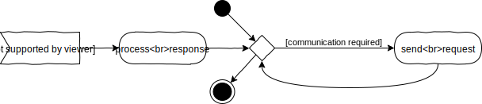

## _V_ **2.5** Kommunikation

### Inhaltsverzeichnis

- [Kommunikation](#kommunikation)
  - [Synchron](#synchron)
  - [Asynchron](#asynchron)
- [Implementation asynchroner Kommunikation](#implementation-asynchroner-kommunikation)
  - [XMLHttpRequest-Events](#xmlhttprequest-events)
  - [Fetch und Promises](#fetch-und-promises)
  - [Async/Await](#asyncawait)
- [Q&A](#-fragen-und-antworten)

## Kommunikation
Kommunikation ist der Prozess des Austauschs oder der Übertragung von Information. Dabei werden zwei grundsätzliche Formen derselben unterschieden. 

### Synchron
  

Synchron bedeutet "zeitlich gemeinsam". Bei der Kommunikation heißt das allerdings nicht gleichzeitig, sondern "aufeinander abgestimmt". Das bedeutet, dass die Kommunikationspartner aufeinander warten, bis der jeweils andere seine Information übertragen hat und dann ihrerseits mit einer Übertragung beginnen. Das bedeutet zwangsläufig, dass die beteiligten Systeme die Hälfte der zur Verfügung stehenden Zeit mit Warten verbringen. Im Diagram, welches den Kommunikationsalgorithmus eines der Partner darstellt, wird dies mit der kleinen Schleife angedeutet.  

> - Sammle Beispiele für synchrone Kommunikation in deinem eigenen Alltag.  

So klein diese Schleife auch erscheint, sie kann ein großes Problem darstellen. Die Systeme könnten die Wartezeiten sinnvoll nutzen, anstatt nur in Ihnen zu verharren. Besonders problematisch wird es, wenn ein System für die Antwort lange braucht. Wenn beispielsweise eine Webseite nicht mehr reagiert, weil der Browser auf eine Antwort des Servers wartet, wird der Nutzer den Prozess bald abbrechen. **Darum sollte synchrone Kommunikation in der Implementierung, besonders bei Systemen, welche ein bemerkbare Ladezeit haben, vermieden werden, um ein Blockieren des Systems zu verhindern.**

### Asynchron

  
Daher hat sich die asynchrone Kommunikation durchgesetzt. Die Kommunikationspartner setzen eine oder mehrere Anfragen ab, damit ist ihr Teil zunächst erledigt und sie können sich um andere Aufgaben kümmern. Irgendwann kommt ein Signal, dass eine Antwort auf eine der Anfragen vorliegt. Dieses dient als Startpunkt für einen neuen Prozess, bei dem zunächst die Antwort verarbeitet wird und gegebenenfalls weitere Anfragen verschickt werden.  

> - Sammle Beispiele für asynchrone Kommunikation in deinem eigenen Alltag.
> - Was sind die besonderen Herausforderungen bei der asynchronen Kommunikation?

Damit ist es Webseiten beispielsweise möglich, die Darstellung aufzubauen und Interaktion zur Verfügung zu stellen, während weitere Daten geladen werden. Oder während der Interaktion mit dem Nutzer Daten zu versenden.

## Implementation asynchroner Kommunikation

### XmlHttpRequest-Events
Bei der asynchronen Kommunikation lässt sich wieder sehr gut die Ereignissteuerung einsetzen. Javascript bietet hierzu das Standardobjekt / die Standardklasse `XMLHttpRequest` an. Ein solches Objekt kann mit dem Schlüsselwort `new` erzeugt werden. Die Klasse bietet einige Methoden, mit denen recht einfach eine Verbindung zu einem Server aufgebaut und eine Anfrage verschickt werden kann. Während das Objekt die Verbindung verwaltet, erzeugt es bei Statusänderungen entsprechende Events, die wiederum mit dem üblichen Schema von Listeners abgefangen und an die zugehörigen Handlerfunktionen weitergeleitet werden. Auch die vollständige Übertragung der Serverantwort ist eine solche Statusänderung, womit dann die Clientseite einer Server-Client Kommunikation abgebildet werden kann.  
> Das XML im Namen des Objektes verrät, dass es sich dabei um eine **etwas betagte Technologie** handelt, die 1999, während der Standardisierung von HTML4, von Microsoft veröffentlicht wurde. Sie ist aber weit verbreitet und kommt noch häufig zum Einsatz. [Mehr Infos gibt es hier.](https://wiki.selfhtml.org/wiki/JavaScript/XMLHttpRequest)

### Fetch und Promises

2017 wurde die globale Javascript-Funktion `fetch` als Schnittstelle für asynchrone Kommunikation eingeführt. So kann mit einer einzigen Anweisung nach dem Muster `fetch(url [, data])` eine Anfrage verschickt und eine Antwort erhalten werden. Aufgrund der Asynchronität liefert fetch aber nicht sofort die Antwort des Servers, sondern ein Objekt vom Typ `Promise`. Dies kann metaphorisch betrachtet werden: Das Versprechen, das fetch abgibt, verpflichtet dazu, die eigentliche Funktion auszuführen, in diesem Falle also zu kommunizieren, und im Erfolgsfall, sowie im Falle des Misserfolgs, bestimmte weitere Funktionen aufzurufen. Es handelt sich also wieder um eine Ereignissteuerung, die aber in einem etwas anderen Gewand daherkommt.  

Im einfachsten Fall sieht das ganze Konstrukt dann so aus:
```typescript
function communicate(_url: RequestInfo): void {
  // try to communicate
  let promise: Promise<Response> = fetch(_url);
  // establish the functions to call when communications 1. succeeds, 2. fails
  promise.then(handleSuccess, handleFailure);
}

function handleFailure(_response: Response): void {
  console.log("Failure", _response);
}

function handleSuccess(_response: Response): void {
  console.log("Success", _response);
}
```
Auch hier ist die Funktionalität über mehrere Funktionen verteilt und daher insgesamt etwas unübersichtlich. Das wird noch verstärkt dadurch, dass die Response, die den Handlern von der Promise als Parameter übergeben wird, noch nicht die Rohdaten der Antwort des Kommunikationspartners darstellt. Um die Response zu verarbeiten sind weitere Funktionen erforderlich, die wiederum Promises erzeugen, die weitere Handler aufrufen und so weiter. 
> **FunFact:** Dadurch entsteht ein Gewirr an Funktionen, das von Entwicklern als "Callback Hell" bezeichnet wird.

### Async/Await

Deswegen wurden 2017 auch die neuen Schlüsselworte `async` und `await` in Javascript implementiert. Damit wird nun etwas ganz Erstaunliches möglich: Anstatt mit der synchronen Programmierweise (eine Anweisung im Code erfolgt strikt nach Beendigung der vorangegangenen) und Events asynchrone Prozesse abzubilden und damit "Callback Hell" zu erzeugen, wird mit Hilfe der beiden Schlüsselworte die Programmierung selbst asynchron. Damit wird das fetch-Beispiel plötzlich extrem übersichtlich:

```typescript
async function communicate(_url: RequestInfo): Promise<void> {
  let response: Response = await fetch(_url);
  console.log("Response", response);
}
```
Mit dem Schlüsselwort `async` wird eine Funktion als asynchron deklariert, das bedeutet, dass ihre Ausführung unterbrochen und zu einem späteren Zeitpunkt fortgesetzt werden kann. Genau dies bewirkt das Schlüsselwort `await`, welches daher nur innerhalb von asynchronen Funktionen Sinn ergibt. Sobald `fetch` gestartet wird, wird die Funktion `communicate` zunächst beendet und die Ausführung des Programms bei der nächsten Anweisung nach deren Aufruf fortgesetzt. Sobald aber `fetch` beendet wurde, wird die Funktion `communicate` bei der Anweisung nach dem fetch fortgesetzt. Das heißt also, dass das Hauptprogramm, sofern es noch nicht komplett abgelaufen ist, unterbrochen wird um die Ausgabe der Response in der Konsole zu bewerkstelligen. Danach ist `communicate` tatsächlich am Ende und das Hauptprogramm wird fortgesetzt. Es könnten aber in der Funktion noch weitere `await`s folgen, die wieder entsprechendes Verhalten bewirken. So bläht die weitere Verarbeitung der Response den Code nicht noch wieder durch Callbacks auf.  
> - Kopieren Sie obenstehenden asynchronen Code und betten Sie ihn in ein neues Programm ein. Lassen Sie vom Hauptprogramm aus die Funktion `communicate` mit dem Parameter `"https://hs-furtwangen.github.io/GIS-WiSe-2020-2021/content/L2.5/test.txt"` aufrufen. Lassen Sie vor und nach dem Aufruf von `communicate` in der Konsole die Zeichenketten "Start" und "End" ausgeben.
> - Starten Sie nun das Programm, nachdem Sie es lauffähig implementiert haben. Beschreiben Sie ihre Beobachtung. In welcher Reihenfolge kommen die Ausgaben in der Konsole?
> - Das ausgegebene Response-Objekt ist komplex und der eigentliche Inhalt der Serverantwort ist noch nicht zu sehen. Erweitern Sie die Funktion `communicate` um eine Zeile, in der Sie die Methode `text()` des Response-Objektes aufrufen.  
Achtung: `text()` gibt wieder eine Promise zurück. Nutzen Sie aber auch hier `await`, erhalten Sie als Ergebnis des Ganzen eine Zeichenkette, die Sie einer Variablen vom Typ string zuweisen können. Lassen Sie so den Inhalt der Serverantwort ausgeben. 
> - Versuchen Sie das gleiche nochmal mit dem Parameter `"https://hs-furtwangen.github.io/GIS-WiSe-2020-2021/content/L2.5/testjson.json"` und der Funktion `json()` statt `text()`. Was wird hier zurückgegeben?

> **Hinweis**: fetch erwartet immer eine `http(s)://` Anfrage, wenn Sie es also lokal testen wollen, sollten Sie einen Live-Server verwenden, da sonst die Anfrage mit `file://` beginnt. Siehe auch den [Hinweise zu LocalStorage](../L2.4#local-storage).


### Typescript Dokumentation

https://www.typescriptlang.org/

---

## **?!** Fragen und Antworten

(die Publikation der Zusammenfassung erfolgt nach dem Q&A-Termin)

Zusammenfassung von: [&lt;username&gt;](https://github.com/)

