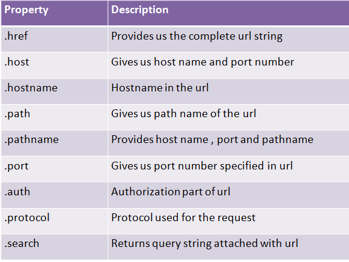

## _V_ **3.2** Server Request Verarbeitung

## URL Modul

Für diese Aufgabe benötigen Sie das [<ins>URL Modul</ins>](https://www.w3schools.com/nodejs/nodejs_url.asp) von Node.js. 

Die Aufgabe des URL Moduls ist es, einen URL (Adresse einer Website oder Unterseite + zusätzliche Attribute) in einzelne, les- und verwendbare Teile aufzusplitten. So können u.a. Anfragen von Nutzern die per GET über eine URL an einen Server verschickt werden besser/einfacher weiterverarbeitet werden. 

Diese Methode wird oft verwendet, um zum Beispiel eine Suchanfrage in einer Datenbank durchzuführen, oder Inforamtionen an ein Skript zu senden. 

>**Hinweis** Node.js Module funktionieren ausschließlich serverseitig. Wenn Sie versuchen Node.js Module in Ihrem Client zu verwenden wird das nicht funktionieren.

Um einen Server zu entwickeln, der Anfragen von Clients verarbeiten kann, brauchen Sie zunächst immer (wie in Aufgabe 8) das Modul `http`, damit Ihr Server über das HTTP Protokoll erreicht werden kann. Das Modul `url` hilft Ihnen, den query-String zu extrahieren und zu interpretieren. Beide Module können mit dem Schlüsselwort `import` geladen und einer Variablen zugewiesen werden, über welche auf die Funktionen und Objekte der jeweiligen Module zugegriffen werden kann. Das Symbol `*` gibt dabei an, dass sämtliche Funktionalität der Module importiert werden soll, hier könnte auch eine einschränkendere Auswahl getroffen werden, was die allgemeine Performance steigert (da dann nicht alle Teilmodule eines Moduls geladen werden).

Sie benötigen also in Ihrer Serverklasse `http` und `url`:

```typescript
import * as Http from "http";
import * as Url from "url";

export namespace ... {
    Http.createServer(...);
}
```
**Achtung:** Wird `import` verwendet, geht TypeScript davon aus, dass ein eigenes, neues Modul erzeugt werden soll und fordert ggf. das Schlüsselwort `export` vor `namespace`, auch wenn es hier eigentlich bedeutungslos ist. Ein Fall ist bekannt bei dem dieses `export` eine Fehlerhafte js Datei erzeugt hat. Wenn das bei Ihnen auch der Fall ist, melden Sie sich bitte.

Viele der Standardmodule, wie `http` und `url`, sind in der [Node-Dokumentation](https://nodejs.org/de/docs/) beschrieben.

> - Testen Sie nun folgenden Beispielcode auf Ihrem Node.js Server und stellen Sie sicher, dass Sie die aktuelle Version von Node typings installiert haben. Zum Aktualisieren führen Sie einfach `npm install --save-dev @types/node` im Terminal Ihres Servers aus.

>**Wo soll ich den Code testen?** Zunächst einmal lokal über einen im Terminal gestarteten node server. Fertige Anwendungen dann nochmal auf Ihrem Heroku Server. Hier finden Sie noch einmal den [Node-Server-Beispielcode](https://github.com/Plagiatus/GIS_SoSe2020/blob/master/Aufgabe08/Server/server.ts) aus der letzten Aufgabe der größtenteils Ihrem Heroku Server entsprechen sollte. Für Beispielcode wie den folgenden, bietet es sich auch immer an, eine eigene Datei anzulegen und so ohne die Umstände des eigentlichen Codes ein wenig herumprobieren zu können.

### Import des URL Moduls:

```TypeScript
//Diese Zeile bei den Import Statements hinzufügen:
import * as url from "url";
```

### URL Anlegen und Parsen

```TypeScript
//Diesen Code innerhalb von einem aktiven Server testen:

let adresse: string = 'http://localhost:8080/default.htm?jahr=2017&monat=february';
//Adresse parsen (umwandeln):
let q = url.parse(adresse, true);

/*Die parse Methode gibt ein Objekt zurück, dass die URL Eigenschaften enthält. So können die fest definierten Eigenschaften einer URL ausgelesen werden:*/
console.log(q.host);
console.log(q.pathname);
console.log(q.search);

/*Die query Eigenschaft gibt ein Ojekt zurück, dass alle query-string Parameter als Eigenschaften besitzt. So können beliebig gesendete Attribute ausgelesen werden:*/
var qdata = q.query;
console.log(qdata.monat);
```

### Eigenschaften des URL Objektes

> Siehe auch nochmal [das Diagramm zum URL aus A08](../L08/#uniform-resource-locator-url)



> - Untersuchen Sie folgende Tabelle und vergleichen Sie mit dem Beispiel. Wie können Sie auf den Port des URL im Beispiel oben zugreifen? Wie auf das mitgelieferte Custom-Attribut `jahr`?
> - Fangen Sie die URL eines Klienten ab und testen Sie, ob Sie einen über ein per HTML Formular und `GET` gesendeten URL in die Einzelteile zerlegen können.


>**Hinweis** Es ist hilfreich auch den folgenden Absatz zu lesen bevor Sie mit dem Testen auf Ihrem Server anfangen.

## Handle Request

>**Hinweis** Im Praktikum letztes Semester wurde angesprochen, dass Sie zusätzliche Videoressourcen hilfreich fänden. Folgende Videos von Prof. Jirka Dell'Oro Friedel beschäftigen sich mit dieser Thematik und helfen ein besseres Verständnis für die Serverseitige Verarbeitung von `GET` Anfragen aufzubauen, sind jedoch in dem bestehenden Kontext einer anderen Aufgabe eingebettet.
<div align="center"><video controls width="30%"> 
  <source src="http://games.hs-furtwangen.de/EIA2_Video/L06_V3_Implementation_Server1.mp4" type="video/mp4"> 
<a href="http://games.hs-furtwangen.de/EIA2_Video/L06_V3_Implementation_Server1.mp4"></a>
</video> 
<video controls width="30%"> 
  <source src="http://games.hs-furtwangen.de/EIA2_Video/L06_V4_Implementation_Server2.mp4" type="video/mp4"> 
<a href="http://games.hs-furtwangen.de/EIA2_Video/L06_V4_Implementation_Server2.mp4"></a>
</video> 
<video controls width="30%"> 
  <source src="http://games.hs-furtwangen.de/EIA2_Video/L06_V5_Implementation_Client.mp4" type="video/mp4"> 
<a href="http://games.hs-furtwangen.de/EIA2_Video/L06_V5_Implementation_Client.mp4"></a>
</video>  
</div>

- Video 1: Einfachen Server (Ähnlich wie der Beispiel-Server aus A8) aufsetzen, einfaches Request Handling
- Video 2: Komplexeres Request Handling und Antwort an Client zurückschicken
- Video 3: Antwort des Servers auf dem Client verarbeiten

Um Anfragen von Nutzern auf einem Server verarbeiten zu können, wurde auf dem [<ins>Beispiel-Node-Server</ins>](https://github.com/Plagiatus/GIS_SoSe2020/blob/master/Aufgabe08/Server/server.ts) der letzten Aufgabe folgender Event-Listener installiert:

```TypeScript
server.addListener("request", handleRequest);
```

Dieser Listener ruft für jede eingehende Anfrage eines Nutzers die Funktion `handleRequest` auf, in der die Anfragen von Nutzern verarbeitet werden. Das Ganze erinnert an die Events die Sie aus dem DOM und den letzten Aufgaben gewöhnt sind.

Die Events die auf einem Node Server ankommen und verarbeitet werden sind jedoch keine DOM-Events! Schließlich ist HTML nicht die Grundlage auf der Serverseite, sondern Node.js. Deswegen folgen die Events in Node.js auch nicht der gewohnten Konvention, dass immer ein Event-Objekt an den Handler übergeben wird. 

Der Handler zum Request-Event der Funktion `handleRequest` erwartet zwei Parameter: 
- Den ersten vom Typ `IncomingMessage`
- Den zweiten vom Typ `ServerResponse`, beide aus dem `http`-Modul.  

`IncomingMessage` liefert Informationen zum eingegangenen Request Objekt, zum Beispiel die URL als String. Um daraus bequem den Query-Teil zu extrahieren, bietet das `url`-Modul hilfreiche Methoden. `parse` interpretiert die URL und erzeugt daraus ein neues Objekt, dessen Eigenschaft `query` nun wieder ein assoziatives Array darstellt.

`ServerResponse` ist ein Objekt, welches Informationen für die Antwort sammelt. Dabei wird, wie bei Kommunikationsprotokollen üblich, diese Information in zwei grundlegende Kategorien aufgeteilt:

- Header: Information zur eigentlichen Nachricht
- Body: die Nachricht selbst.

Header-Informationen integrieren Sie mit der Methode `setHeader(...)` des ServerResponse-Objektes. Mit `write(...)` können Sie ganz einfach Zeichenketten dem Nachrichten-Body anfügen und mit `end()` die Antwort an den Klienten verschicken lassen. Eine simple Antwort kann man also so zusammenbauen:
```typescript
function handleRequest(_request: Http.IncomingMessage, _response: Http.ServerResponse): void {
    _response.setHeader("content-type", "text/html; charset=utf-8");
    _response.setHeader("Access-Control-Allow-Origin", "*");
    _response.write("Was geht?");
    _response.end();
}
```
In diesem Beispiel verschickt der Server lediglich die Antwort mit dem Inhalt `"Was geht?"`. Der Header gibt an, dass die Antwort ein mit utf-8 kodierter Text ist, also z.b. kein Bild, und dass sie von jedem geöffnet werden darf. Auch hier bedeutet der Asterisk `*` wieder "alles".

## Post Anfrage Serverseitig auslesen (für Bonusaufgabe relevant)

Dieser Abschnitt ist weder Prüfungsrelevant, noch für die normalen Aufgaben -> Er soll für ein verbessertes Verständnis zu serverseitiger POST-Verarbeitung für alle an der Bonusaufgabe Interessierten geben.

Die Methode `POST` in serverseitigen Anfragen zu verwenden bietet einige Vorteile (es kann trotzdem sinnvoll sein in manchen Fällen `GET` zu verwenden):

- POST ist etwas sicherer als GET, da Informationen nicht in der Suchleiste angezeigt werden. Wenn zum Beispiel Passwörter oder Email-Adressen verschickt werden sollte immer POST verwendet werden.
- POST eignet sich besser für Anweisungsoperationen, wie zum Beispiel eine bestimmte Seite zu löschen, da die URL nie zufällig in die Suchleiste eingegeben werden kann. Eine Url wie z.B. `http://meineWebseite.de/unterseite/delete/123` die zum Beispiel das Bild Nr. 123 löscht, könnte versehentlich oder absichtlich in der Suchleiste angegeben werden und zum Löschen einer Datei führen.
- Mit POST können beliebig viele Daten verschickt werden. GET ist auf 2048 Zeichen beschränkt


Die Verarbeitung von POST Anfragen in Node.js ist jedoch nicht ganz einfach. Hier sind zwei hilfreiche Ressourcen, um POST-Anfragen serverseitig verabeiten zu können, ansonsten können Sie sich auch direkt den weiter unten stehenden Beispielcode ansehen.

- [POST Daten ohne extentions auslesen](https://itnext.io/how-to-handle-the-post-request-body-in-node-js-without-using-a-framework-cd2038b93190)
- [POST Daten mithilfe von Express auslesen](https://stackoverflow.com/questions/4295782/how-to-process-post-data-in-node-js)

> **Hinweis** Der Vollständigkeit halber soll an dieser Stelle nicht unerwähnt bleiben, dass es neben GET und POST noch weitere, teilweise ähnlich funktionierende Serveranfragen gibt, welche für spezielle Anfragen genutzt werden können: HEAD, PUT, PATCH, DELETE, OPTIONS, etc. Will man z.B. wie oben erwähnt eine Löschanweisung an den Server senden, so könnte man dies über POST machen, noch besser wäre es aber, eine DELETE Anfrage zu verwenden. Diese verschiedenen Arten von Anfragen sind auch als das **REST Modell** (Representational State Transfer) bekannt.

Beispielcode Clientseite
```typescript
await fetch(serverAddress, {
  method: "POST",
  headers: {
    "Content-Type": "text/plain",
  },
  body: JSON.stringify(data)
});
```
Beispielcode Serverseite
```typescript
if (_request.method == "POST") {
  let body = "";
  _request.on("data", data => {
    body += data;
  });
  _request.on("end", async () => {
    let post: any = JSON.parse(body);
  });
}
```


### Was Sie jetzt im Prinzip können:
- asynchrone Kommunikation
- Server-Client Kommunikation
- Daten
  - schicken
  - empfangen
  - aufbereiten
  - umwandeln

Diese Tools sind bereits sehr mächtig und die Grundlage fast jeder App, Webseite u.ä.  
Mit diesem Wissen könnten Sie jetzt beginnen, ihre eigenen Webapps zu schreiben.

### Typescript Dokumentation

https://www.typescriptlang.org/

---

## **?!** Fragen und Antworten

(die Publikation der Zusammenfassung erfolgt nach dem Q&A-Termin)

Zusammenfassung von: [&lt;GitHub Nutzername&gt;](https://github.com/link-zu-github-profil)

### Erste Frage?
LoremLabore labore cillum mollit pariatur reprehenderit dolor laboris reprehenderit dolor sit officia ea non. Lorem reprehenderit exercitation labore eiusmod aute do nostrud officia aute proident sunt. Labore non tempor aliqua voluptate. Exercitation culpa officia ut aliqua nostrud laborum irure est. Minim eu sunt culpa adipisicing laborum consectetur aliqua quis.

### Zweite Frage?
Mollit aliquip veniam sit eiusmod tempor anim ipsum tempor. Aliqua sunt voluptate ea dolor. Nulla est mollit consectetur cupidatat ut cillum ipsum minim. Est ex et nulla laborum fugiat dolore. Aliquip laboris sint exercitation commodo dolor sint mollit qui sunt ipsum fugiat occaecat id enim.

## ...
