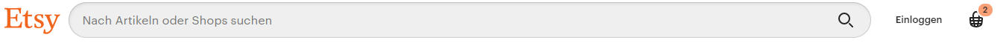

## _P_ **2.3** DOM Manipulation und Event Handling

### Aufgabe 1

Wiederholen Sie Aufgabe 3 von [letzter Woche](#P2.2). Nutzen Sie aber statt dem Canvas `<div>`s (oder andere DOM Elemente): erzeugen Sie diese dynamisch, setzen Sie die richtige Position und Farbe, etc.

Fügen Sie außerdem ganz am Anfang der Seite zwei Buttons ein und installieren Sie auf diesen je einen Eventlistener:
- Der erste Button soll ein weiteres Rechteck hinzufügen.
- Der zweite Button soll die Seite zurücksetzen.

### Aufgabe 2

Lesen Sie, falls noch nicht geschehen, die Kapitelaufgabe durch. Entscheiden Sie sich für ein Thema, das von Ihrer Seite umgesetzt werden soll.

**a)** Entwickeln Sie ein (oder mehrere, wahrscheinlich verschachtelt) geeignetes Interface (oder Klassen), um die relevanten Daten ihrer Auswahlmöglichkeiten speichern zu können. Bedenken Sie dabei alle relevanten Attribute Ihrer Auswahlmöglichkeiten sowie der verschiedenen Kategorien in denen diese Wahlmöglichkeiten zur Verfügung stehen sollen (wie z.B. Name, Farbe, Darstellung, Preis, etc.).

**b)** Entwickeln Sie ein Interface, über das sie die ausgewählten Elemente abspeichern können. Gehen Sie dabei davon aus, dass die Daten der Optionen zur Verfügung stehen.

**c)** Legen Sie die tatsächlichen Daten in einer Variablen an. Legen sie dazu eine Datei `data.ts` an, in der sich lediglich diese Variable mit den Daten befindet (s. [Namespaces](../L2.2#namespaces) zur Unterstützung beim Arbeiten mit Dateien).

**d)** Machen Sie sich Gedanken darüber, wie die einzelnen Unterseiten aussehen und funktionieren sollen. Fertigen Sie gerne eine Skizze an, um sich selbst bei der Visualisierung zu helfen.


### Aufgabe 3

Nachdem in Aufgabe 2 nun die Vorarbeit geleistet wurde, sollen Sie in dieser Aufgabe nun eine dieser Unterseiten Umsetzen.

**a)** Entwerfen Sie zunächst ihre Seite mit reinem HTML (und CSS). Füllen Sie die Daten der ersten Seite noch manuell in die Seite ein, um so das Layout und die Gestaltung zu testen.

**b)** Verlagern Sie nun nach und nach die Abschnitte, die mit den Daten befüllt werden aus dem HTML in ihr TS und generieren Sie diese Abschnitte automatisch, abhängig von den Daten. _Achten Sie dabei auf Variabilität: Die Seitengenerierung sollte auch weiterhin funktionieren, wenn Sie eine Auswahlmöglichkeit hinzufügen oder entfernen!_

**c)** Belegen Sie die geeigneten Elemente (z.B. Buttons) in ihrer generierten Seite mit Eventlistenern, welche die zugehörige Auswahlmöglichkeit auswählt. Geben Sie die Variable, in der die Auswahl gespeichert ist, auf der Konsole aus.

<!-- >**Bei Problemen/Unklarheiten:** können Sie wie immer ins Praktikum kommen oder per Discord / Github Issues (/ EMail) Fragen stellen.

Erstellen Sie ein neues Verzeichnis und kopieren Sie die Dateien der letzten Aufgabe hinein. 

Die Aufgabe baut auf der Shop Aufgabe der letzten 2 Wochen auf. 

>**Empfehlung:** Sorgen Sie dafür, dass es nur 1 Shopseite mit allen Artikeln gibt, da Sie andernfalls auf allen Seiten auf denen Produkte angezeigt werden die Kriterien der Aufgabe 1 und Aufgabe 2 erfüllen müssen. 

Ziel der Praktikumsaufgabe ist es mithilfe von Events den Usern Ihres Shops eine bessere Interaktion mit der Website zu ermöglichen.

## Teilaufgabe 1

Registrieren Sie einen Klick-Event-Listener der die Maus-/Toucheingabe eines Users auf einen der Kaufen-Buttons detektiert. Beim Klick auf einen der Kaufen-Buttons soll über/neben dem Warenkorb (der Warenkorb **muss sichtbar bleiben**) z.B. in einem Kreis die Anzahl der geklickten Artikel angezeigt werden. Bei 0 Artikeln ist nichts sichtbar.

>**Anmerkung:** Denken Sie daran: Wenn Sie Code kopieren machen Sie etwa falsch. In diesem Fall sollte es nur eine einzige Funktion geben, welche dann von den Buttons aufgerufen wird, ggf mit passenden Übergabeparametern

### Beispiele aus echten Shops:




Berechnen Sie außerdem bei jedem Klick die Gesamt-Summe der Preise aller angeklickten Artikel und geben sie diese in der Konsole aus.  
Um das ganze sinnvoll zu gestalten, dürfen **nicht alle Artikel das Gleiche kosten**.

>**Anmerkung:** Ggf. müssen Sie Ihr Artikel-Interface aus der vorherigen Aufgabe so anpassen, dass der Preis nicht als string sondern als number gespeichert wird. Beachten Sie zwecks der Preisberechnung auch die Lösungshinweise weiter unten.

## Teilaufgabe 2

Anstelle von Sprungmarken (oder extra Seiten), die die Nutzer zu einer jeweiligen Kategorie bringen, sollen in der Navigationsleiste/Headdermenü/Hauptmenü per Klick-Event-Listener alle Artikel der "falschen" Kategorie ausgeblendet werden, sodass ausschließlich alle Artikel der geklickten Kategorie übrig bleiben. Des weiteren soll eine neue Option in der Navigationsleiste/Headdermenü/Hauptmenü ebenfalls per Klick-Event-Listener alle Artikel wieder einblenden. Dies bedeutet auch, dass die Artikel anderweitig ihren Kategorien zugeordnet werden sollten, statt über mehrere Arrays.

### Hinweise

>**Lösungshinweise** für beide Aufgaben  
Es gibt hier viele verschiedene Möglichkeiten, diese Probleme zu lösen. Hier sollen drei verschiedene Ansätze genannt werden, um Ihnen den Einstieg in die Aufgabe zu erleichtern:
> - _Abreißen und neu bauen_ - bei jeder Änderung der "Anzeigekriterien" entfernt man alle Artikel und erschafft nur die benötigten neu. Dies ist die einfachste Lösung, aber spätestens nächste Woche wird diese Probleme machen. Außerdem hilft sie nicht für Teilaufgabe 1.
> - _Informationen in HTML speichern_ - z.B. durch eigene Attribute die relevanten Informationen in den HTML Elementen selbst speichern. Dies ist zwar einfacher machbar, aber anfälliger für Änderungen (z.B. Preisänderungen) durch den Nutzer und folgt außerdem nicht dem Paradigma der Trennung von Funktionalität und Inhalt.
> - _Verbindung herstellen_ - irgendwie eine Verbindung zwischen den HTML Artikeln und den in JS abgelegten Daten über diese Artikel herstellen (z.B. über die indexierung des Arrays in dem die Artikel gespeichert sind). Die wahrscheinlich logisch komplexeste Lösung, aber dafür die sicherste und am besten für die kommenden Wochen geeignete Lösung.  

> Wir empfehlen dringend, dass Sie Ihre Lösungsidee zunächst auf dem Papier oder im kleinen Beispiel durchdenken und durchspielen, da es doch einige Stolperfallen gibt in die man sonst reinfallen könnte. **Diese Aufgabe ist nicht trivial!**

- mit [Element.setAttribute()](https://www.w3schools.com/jsref/met_element_setattribute.asp) und [.getAttribute()](https://www.w3schools.com/jsref/met_element_getattribute.asp) kann man einem Element eigene Atrribute hinzufügen und hinterher auch wieder abfragen.
- über das Event.target/currentTarget bekommt man zwar den Button zurückgeliefert, aber TS weiß nur, dass es vom Typ EventTarget ist. Somit können wir nicht auf die Eigenschaften von Node bzw. Element zugreifen, die wir brauchen. Wir können über die Typannotation dem TS versichern, dass wir wissen dass das EventTarget tatsächlich ein Element ist:  
```typescript
let target: HTMLElement = (<HTMLElement>_event.target);
// target.parentNode....
// target.getAttribute(...)...
```

>### **Achtung!:** Beachten Sie die [<ins>Coding Style Guidelines</ins>](https://hs-furtwangen.github.io/GIS-WiSe-2020-2021/codingstyle/). Code der diesen Guidelines nicht entpricht wird nicht akzeptiert! Code der W3 Errors oder JS-Errors aufweist wird ebenfalls nicht akzeptiert! Verstöße fürhen zu einer Ampelstufe 🚦

## Bonusaufgabe (keine Pflicht):

Implementieren Sie in der Navigation eine primitive Suchleiste die, optimalerweise mithilfe von RegEx, ansonsten mit String-Vergleichen, nach Übereinstimmungen sucht. Informieren Sie sich dafür über [RegEx](https://regexr.com/). Blenden Sie alle Items aus, in der weder in der Beschreibung noch im Titel eines Artikels ein Match gefunden wurde. -->
